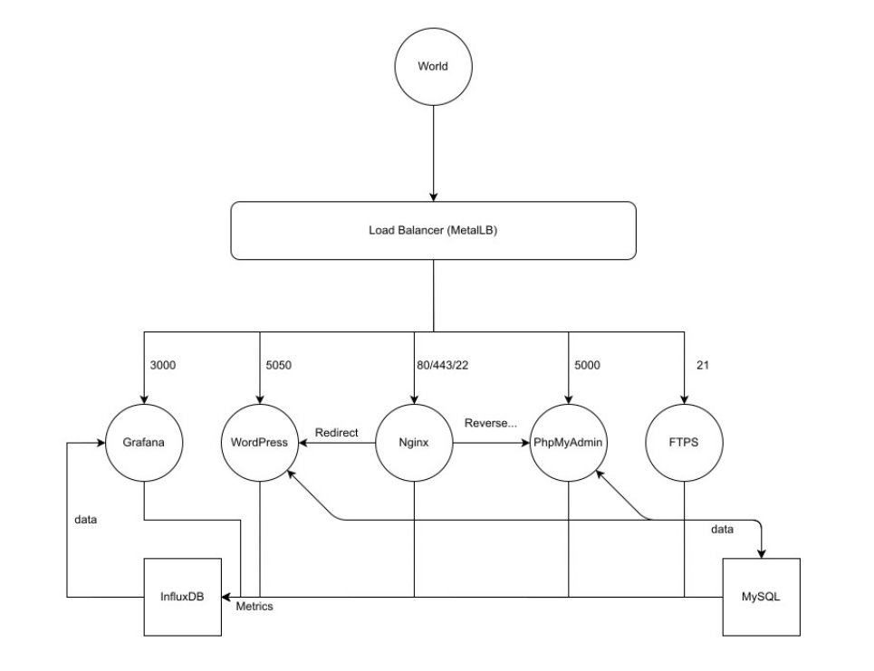

## ft_services

project of 42 school where it is necessary to deploy
Kubernetes cluster via minikube to run it locally.

the cluster needs to work with several services like nginx, FTPS, wordpress and phpMyAdmin running with mysql database, and grafana linked to InfluxDB database for monitoring.

each service runs in a separate container.

the initial script builds a custom docker image for each of them before deploying and run them all using custom yaml files.

if a container component crashes or stops, containers are restarted automatically.



### list of components
| name | description |
| ------------ | ------------ |
| metallb | manages external access to the services. the only entrance to the cluster |
| nginx | web server allowing to host a website |
| wordpress | content managament system, focused on the creation of any type of web page |
| mariadb | database to store wordpress data |
| phpmyadmin | an administration tool for mysql |
| grafana | analytics and interactive visualization web application. allows you to explore metrics |
| influxdb | database used to store the measurements of the services, where grafana takes the data |
| telegraf | information gathering software to service data to store in influxdb |
| ftps | secure file server by ssl protocol for the encryption of transfers |

### how to use
before launching `docker`, `kubectl` and `minikube` should be installed.

to launch the project:
```
bash setup.sh
```
go to the site `https://192.168.99.200` to see all available resources.

wordpress, phpMyAdmin and grafana have the same usernames and passwords: `admin` `admin`

to stop the project:
```
bash srcs/del.sh
minikube delete
```
